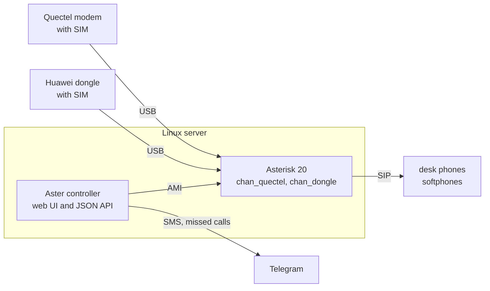

<p align="center">
  <picture>
    <source media="(prefers-color-scheme: dark)" srcset="packages/ui/src/assets/brand/lockup-on-dark.svg">
    
  </picture>
</p>

# Aster

**A web-managed GSM gateway for Asterisk.** It runs the
[`chan_quectel`](https://github.com/IchthysMaranatha/asterisk-chan-quectel) and
[`chan_dongle`](https://github.com/wdoekes/asterisk-chan-dongle) channel drivers in a container, puts a web UI in
front of them, and turns USB cellular modems into SIP lines your desk phones can use.

`chan_quectel` and `chan_dongle` are the Asterisk channel drivers that make a USB cellular modem behave like a phone
line: voice calls, SMS and USSD over a SIM instead of a VoIP provider. They work well, but configuring them means
hand-editing `quectel.conf`, `dongle.conf` and a dialplan, and getting them to survive a modem being unplugged is its
own project. Aster is the layer that does that for you: it discovers the modems, writes those files, reloads only
what changed, and gives you a browser page instead of an SSH session.



## Install

```sh
sudo git clone <this repository> /srv/aster
sudo /srv/aster/install/install.sh
```

That pulls both images, asks for an admin password and starts everything. Open `http://<the box>/` and log in.

Add `--build` to build the images from the checkout instead, which is what a tree with local changes in it needs. The
first build compiles Asterisk from source, so give it several minutes, or an hour on a Raspberry Pi. An appliance keeps
whichever of the two it was installed with: `aster update` then pulls or rebuilds to match.

Run it again any time: it changes nothing it does not have to, and never overwrites a file you edited yourself. What
it decided — the port, and which images the appliance runs — it writes to `.env` in that folder; see
[Settings](#settings-env).

## What you get

- **Inbound calls.** A call to a SIM rings the phones you picked for it. Ring groups are a list of checkboxes.
- **Outbound calls.** Each phone dials out through the modem you assign it.
- **SMS.** Incoming messages appear in the UI and in Telegram. You can send from the UI, with delivery reports and
  retry, and delete one SMS or the whole list (calls too).
- **Missed-call alerts.** A Telegram message with the caller's number and the time.
- **Modem control.** Start, stop, reset, check signal. Call forwarding (always, or when busy, unanswered or unreachable)
  and USSD codes (balance, top-ups) without a terminal. A raw AT console when you need one.
- **Hot-plug that works.** Modems are matched by IMEI, so unplugging one or rebooting does not shuffle your lines.
- **Config editor.** The Asterisk files stay editable in the browser, checked before they apply, with one click to
  undo a change Asterisk rejected.
- **English and Russian UI**, usable on a phone screen.

## Supported modems

Tested on a Raspberry Pi 5 with:

| Modem | Driver | Notes |
|---|---|---|
| Quectel EC25 | `chan_quectel` | LTE, voice over USB audio class |
| Huawei E173 | `chan_dongle` | 3G, voice over the modem's own tty |

The drivers themselves handle a wider range — `chan_quectel` covers other Quectel EC-series and SimCom modules,
`chan_dongle` covers most Huawei 3G sticks. Those should work, but have not been tried here.

## Requirements

**Hardware.** A Linux machine that stays on (a Pi 5 is plenty), one USB modem per SIM, a SIM with its PIN disabled,
and SIP phones — desk phones on the same network or a softphone app. Use a powered USB hub: modems pull a lot of
current when the radio transmits.

**Software.** Debian, Ubuntu or Raspberry Pi OS, amd64 or arm64. Docker Engine 25+ with the compose plugin 2.20.2+,
which the installer can add for you (`--install-docker`). 2 GB of free disk. Ports 80, 5060 and 5038 free.

You do not need Node.js or Asterisk installed first. Everything runs in the two containers.

**A Quectel modem's USB sound card.** A Quectel in UAC mode is a USB sound card, driven by the kernel's
`snd_usb_audio`. That driver has had a low-latency mode since Linux 5.19, on by default, and with an EC25 on a 6.18
kernel it never gets the stream *to* the modem running: the far end hears nothing, and often you hear nothing either,
while the modem looks fine. The installer writes `options snd_usb_audio lowlatency=0` to
`/etc/modprobe.d/aster-snd-usb-audio.conf` (the classic mode; the few milliseconds it costs mean nothing on a phone
call). The option is read when the module loads, so an appliance whose module was already loaded needs one reboot
after the install; `aster doctor` says which mode is running.

## First run

1. **Overview → Scan.** Aster reads the USB bus and lists the modems it found.
2. **Assign** each one a short name such as `gsm1`. It becomes a line.
3. **Phones.** A fresh install defines phones 501–515. Open one and set a real password.
4. **Point a SIP phone at the box.** Server is the box's address, username is the phone's number, password is the one
   you just set.
5. **On the modem's page, tick the phones that should ring** when that SIM is called.

> The starter phones have their password set to their own number. That is fine for a first test and not fine
> afterwards. Change them before the box is reachable from anywhere but your own network.

## Running it

Day to day you work in the web UI. From a terminal on the box:

| Command | |
|---|---|
| `aster status` | are both containers running |
| `aster logs` | follow the logs |
| `aster start` | start them (and apply an edited `.env`) |
| `aster stop` | stop them; `aster start` brings them back |
| `aster restart` | restart both, or one |
| `aster doctor` | check the appliance and say what is wrong |
| `aster backup` | write an archive into `backups/` (ten are kept) |
| `aster update` | back up, fetch the new version, restart into it (`--force`: without the backup) |
| `aster passwd` | change the admin password |

### Settings: `.env`

There is nothing to copy by hand. `install.sh` writes `.env` itself, from
[`install/env.example`](install/env.example) — the template's comments come with it — and a re-run reads the values
back, so an appliance keeps what it was installed with. It sits beside
[`docker-compose.yml`](docker-compose.yml) in the folder you cloned into, which is where compose looks for it on its
own: on an installed box, `sudo docker compose up -d` there is the same command `aster start` runs. One folder is one
appliance because of that.

Compose on its own is not an install. The containers need what `install.sh` writes around them — the data tree, the
secrets, `manager.conf` with the AMI secret, the generated `aster.d`, the udev rule, the USB audio module option — and without them the controller
stops at `secrets file not found: …/config/secrets.env` and Asterisk comes up on its own built-in defaults, with no
dialplan and no AMI user for the controller to log in with.

| | |
|---|---|
| `ASTER_HTTP_PORT` | the port the UI and the API listen on (`--http-port`) |
| `ASTER_IMAGE_SOURCE` | `pull` for the published images, `build` to build them from the checkout (`--pull`, `--build`) |
| `ASTER_IMAGE_NS`, `ASTER_VERSION` | which images that means: `sheepsticked/aster-{asterisk,controller}:latest` for a pull, `aster/aster-*:dev` for a local build. Point them at your own registry to run images you built and pushed |
| `ASTER_REPO`, `ASTER_HOME` | where the checkout and the data are — install.sh keeps both current; the `aster` command passes them itself |

Change one of them either way: re-run the installer with the option (`sudo install/install.sh --http-port 8080`), or
edit `.env` and run `aster start`, which recreates whatever the new line changed. A plain `aster restart` restarts the
containers as they are, so a new port or a new image tag would not reach them.

Moving an appliance between the two sources moves the image name and tag with it: `install.sh --pull` on a box that
was built locally switches it to the published `sheepsticked/…:latest`, because `aster/…:dev` is a name only a local
build writes. Name `ASTER_IMAGE_NS` or `ASTER_VERSION` in the environment of that run and yours is used instead.

No secret is in that file: the admin password hash, the AMI secret and the Telegram token are in
`data/config/secrets.env`, mode 0600 and root's.

### Telegram

Make a bot with [@BotFather](https://t.me/BotFather), paste the token into **Settings**, add the chat ids that should
receive messages. Aster then sends one message per incoming SMS and per missed call, each starting with the host name
(`[aster] SMS gsm1 from …`). It can also warn you when a modem has been down for five minutes, which is off unless
you turn it on.

### If a call sounds bad

Calls through a modem are 8 kHz audio, the same as any mobile call, so offering a phone a wideband codec changes
nothing. What does help, all of it in **Config**:

| Symptom | Setting | File |
|---|---|---|
| Caller too quiet or too loud | `rxgain` / `txgain` in `[defaults]` | `quectel.conf`, `dongle.conf` |
| Caller distorted on an EC25 | `qrxgain` in `[defaults]`, starts at `8192` | `quectel.conf` |
| Choppy audio from a Wi-Fi softphone | `PHONE_JITTERBUFFER` in `[globals]`, set `adaptive` | `extensions.conf` |

Silence in one or both directions on a Quectel, while the modem shows as connected, is not a setting: it is the
kernel's USB audio driver (see Requirements). `aster doctor` reports the running mode and counts the calls whose
audio never reached the modem (the driver's `UAC audio of this call` line in `logs/asterisk/full`, hundreds of
playback underruns); a card whose setup failed once (`Couldn't set the new hw params`) is retried by the driver
until it opens.

Raise gain one step at a time — clipping sounds worse than quiet. On an EC25 start with `qrxgain`, which acts inside
the modem before the audio is squashed; the modem's own default of 20577 distorts a normal speaking voice, which is
why the starter file lowers it.

## How it works

Two containers. **Asterisk 20** with PJSIP and both channel drivers runs privileged on the host network, because it
needs the USB devices and SIP needs real ports. **The controller** — a Node service serving a Svelte UI — is
unprivileged, runs no shell commands, and drives Asterisk over AMI.

The controller owns one file, `data/config/aster.yaml`, listing your modems, phones, ring groups and recipients.
Every UI change is written there, and the Asterisk configuration is generated from it. That is why a change reloads
only what it touches instead of restarting Asterisk and dropping calls in progress.

Files you write stay yours. Generated output goes to `config/asterisk/aster.d/`, and nothing else under
`config/asterisk/` is ever rewritten, so a custom dialplan survives updates.

```
/srv/aster/                    the clone; the folder is the appliance
  .env                         port and images, written by install.sh (README: Settings)
  data/                        everything it keeps (not in git)
    config/aster.yaml          your modems, phones and settings
    config/secrets.env         password hash, AMI secret, Telegram token
    config/asterisk/           Asterisk files you can edit
    config/asterisk/aster.d/   generated — do not edit
    state/ spool/ logs/        database, event spool, logs
    backups/
```

### The driver patches

Both drivers are built from upstream at pinned commits, with a patch series that adds an AMI protocol for AT
commands (so the controller can run them without a shell), keeps a disabled modem connected with its radio off, fixes
a stack-smash in Quectel port discovery, repairs shared-buffer corruption when two USB-audio calls run at once, and
makes the Quectel driver refuse a sound card whose setup failed and reopen one whose playback stream never runs,
instead of carrying calls without audio, and receives a Quectel modem's SMS delivery reports, which upstream reads from
the wrong storage and loses. See [docker/asterisk/patches/README.md](docker/asterisk/patches/README.md).

### On an SD card

An SD card dies from being written to, mostly from small, frequent file changes. Aster keeps its scratch files and the
phones' registrations in RAM (after an Asterisk restart a phone rings again once it re-registers), checks its
containers every 5 minutes, and the installer moves containerd's temporary files to `/run`. Volatile state
stays in memory, the Asterisk log is written once, container logs are capped. The rest of the host (swap, journald,
`/tmp`) belongs to whoever built the OS image: `aster doctor` reports it and the measured write rate.

## The Asterisk image on its own

The Asterisk image also works without the rest of Aster: `sheepsticked/asterisk-dongle-quectel` is Asterisk 20 with
`chan_dongle`, `chan_quectel` and [the driver patches](#the-driver-patches), for amd64 and arm64. It has no
controller, web UI, generated dialplan or phones. You write the Asterisk configuration yourself.

```sh
# Copy the image's starter files (both drivers, no modems, a SIP transport, an empty dialplan) into ./asterisk:
# tar packs /etc/asterisk inside a throwaway container, the second tar unpacks it here.
mkdir asterisk
docker run --rm --entrypoint tar sheepsticked/asterisk-dongle-quectel -cC /etc/asterisk . | tar -xC asterisk
# Run Asterisk with that folder as its configuration (a mounted folder hides the image's own files).
docker run -d --name asterisk --network host --privileged -v /dev:/dev \
  -v "$PWD/asterisk:/etc/asterisk" -v asterisk-state:/var/lib/asterisk sheepsticked/asterisk-dongle-quectel
```

- Tags: `latest`, and `<Asterisk version>-<commit>` to pin one build.
- Add a section per modem to `dongle.conf` or `quectel.conf`. Keep a separate `smsdb` per driver, as the starter
  files do: both drivers run in one process.
- The patches add the `radio`, `qrxgain` and `smsreport` settings and the `DongleAtCommand`/`QuectelAtCommand` AMI
  actions ([docker/asterisk/patches/README.md](docker/asterisk/patches/README.md)).
- Only the modules in [menuselect.opts](docker/asterisk/menuselect.opts) are built: PJSIP and the basic dialplan
  apps, no voicemail, queues, AGI or ARI. For more, add them there and build it yourself:
  `docker build --target asterisk-dongle-quectel -t my/asterisk docker/asterisk`.
- On the host, keep ModemManager off the modems (the `ID_MM_*` lines of
  [install/udev/90-aster.rules](install/udev/90-aster.rules)). A Quectel's USB sound card needs
  `snd_usb_audio lowlatency=0` (see Requirements).

## Development

Node 24.15+ and Docker, then `npm ci`.

```sh
npm run lint        # type check
npm test            # unit tests
```

| | |
|---|---|
| Asterisk image smoke test | `docker/asterisk/smoke-test.sh aster/aster-asterisk:dev` |
| Installer | `bash test/install/install.test.sh` |
| Whole stack, end to end | `test/e2e/run.sh` |
| UI at phone and desktop sizes | `npm run test:responsive -w packages/ui` |

Run the stack from a checkout by creating a home the way the installer does, then bringing it up:

```sh
ASTER_ADMIN_PASSWORD='dev-password' install/install.sh --home "$PWD/.dev/srv" --build --non-interactive --skip-up
docker compose -f docker/compose.dev.yml up --build     # http://127.0.0.1/
```

[`docker/compose.dev.yml`](docker/compose.dev.yml) extends the appliance's own `docker-compose.yml` and builds both
images from the checkout instead of pulling them, under names of their own (`aster/aster-*:dev`), so it cannot
overwrite what an appliance on the same machine is running.

You can also develop with no modems and no Asterisk at all:

```sh
# a stand-in for Asterisk, so scan, apply, AT, USSD and forwarding run the real controller code
ASTER_HOME="$PWD/.dev/srv" ASTER_AMI_MOCK=1 ASTER_HTTP_PORT=5099 node packages/controller/src/index.js
VITE_API=http://127.0.0.1:5099 npm run dev -w packages/ui

npm run dev:mock -w packages/ui   # UI alone, answers from packages/ui/src/mock/
```

```
docker-compose.yml    the appliance: the only compose file at the root, what install.sh installs and `aster` runs
packages/controller/  Node service: API, database, AMI client, spool, notifications, operations
packages/ui/          Svelte 5 + Vite + Tailwind single-page app
docker/asterisk/      Asterisk images, Aster's and the standalone one: build, driver patches, built-in config, smoke test
docker/controller/    controller image (also builds the UI)
docker/compose.dev.yml  the same two services, built from the checkout, for development
install/              installer, .env template, Asterisk templates, udev rule, modprobe option, Ansible role
tools/                migration tools and a hardware probe
test/                 installer tests, end-to-end run, hardware scripts, fixtures
```

## Credits and licence

Built on [Asterisk](https://www.asterisk.org/), [asterisk-chan-dongle](https://github.com/wdoekes/asterisk-chan-dongle)
and [asterisk-chan-quectel](https://github.com/IchthysMaranatha/asterisk-chan-quectel).

Licensed under the **GNU General Public License v2.0** — see [LICENSE](LICENSE). That is the same licence as
Asterisk and both channel drivers, so the driver patches under `docker/asterisk/patches/` are covered by it too.
